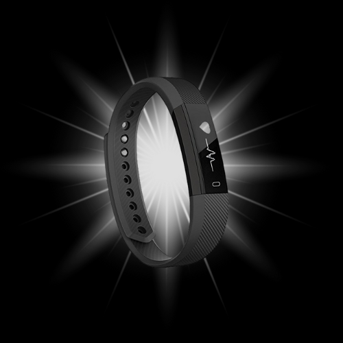
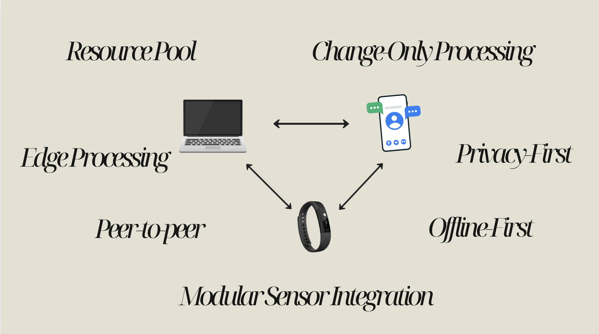

  
  
  

    <em>Companion You Must Have</em>
  

  
  
  

    
    
    
    
  

---

## About Shadow

**Shadow** is an open-source wellness platform designed for privacy-conscious professionals. It unifies data from your Linux laptop, Android phone, and wrist wearable into a cohesive wellness ecosystem with **zero cloud dependency**.

### Key Features
- 🔒 **Privacy-First**: All data processing happens locally on your devices
- 🌐 **Peer-to-Peer**: Devices communicate directly without central servers
- 📊 **Real-time Insights**: Stress management, health monitoring, sleep optimization
- 🔧 **Modular Design**: Easy integration of new devices and sensors

---

## Current Status

### Week 4: AI/ML Model Development (Current)
- ✅ **Modular AI Structure**: Organized AI model development with proper folder structure
- ✅ **Stress Detection Model**: ESP32-based stress detection implementation
- ✅ **ML Model Comparison**: Comprehensive analysis of different ML approaches
- 🔄 **Model Optimization**: Ongoing development and testing of AI models

### Week 3: Hardware Integration
- ✅ **Device Documentation**: Complete hardware specs for MacBook, Android, and wearable devices
- ✅ **Feasibility Report**: End-to-end integration approach and device compatibility analysis
- ✅ **Hardware Architecture**: Detailed system integration design

### Week 2: Architecture Design
- ✅ **Software Architecture**: C4-UML inspired system design
- ✅ **Hardware Architecture**: Device integration blueprint
- ✅ **Component Design**: Modular system architecture

### Week 1: Project Foundation
- ✅ **Requirements Specification**: Complete SRS documentation
- ✅ **Project Vision**: Core concept and technical approach defined
- ✅ **Initial Presentations**: Project overview and technical specifications

---

## Technical Architecture

### Core Principles
- **Edge Processing**: All analytics and ML inference on local devices
- **P2P Communication**: Encrypted device-to-device synchronization
- **Resource Pooling**: Dynamic computational load distribution
- **Modular Integration**: Plug-and-play sensor and device support

### System Overview

  

---

## Development Roadmap

### Completed ✅
- **Week 1**: Project foundation and requirements specification
- **Week 2**: Software and hardware architecture design  
- **Week 3**: Device compatibility analysis and documentation
- **Week 4**: AI/ML model development and optimization

### Current Week 🔄
**Week 5: Hardware Setup & Initial BVP Data Acquisition (Days 1-3)**
- Unbox & connect LilyGo T-Display-S3 + MAX30102
- Set up ESP32-S3 dev environment (ESP-IDF)
- Acquire and verify raw BVP output

### Upcoming ⏳

**Week 6: On-Device BVP Preprocessing & Feature Extraction (Days 4-5)**
- Implement causal bandpass filter in C++ for BVP
- Port simplified HRV feature extraction to ESP32-S3

**Week 7: TinyML BVP Model Integration & Inference (Days 6-9)**
- Convert H-CNN TinyML model (BVP-only) to int8 C array
- Integrate TensorFlow Lite Micro in ESP32-S3 firmware
- Feed preprocessed BVP data into model and get predictions

**Week 8: System Testing & Refinement (BVP-only) (Days 10-14)**
- End-to-end testing with live BVP data
- Log predictions & performance metrics for BVP model
- Identify optimizations for latency, accuracy, and battery use for BVP processing

**Week 9: Battery Optimization, Power Profiling & Robustness Improvements**
- Measure real-world power consumption for BVP processing
- Optimize sampling rate & duty cycles for BVP sensor
- Add low-power sleep/wake cycles for BVP processing
- Handle noisy/weak BVP signals
- Implement fallback logic when BVP sensor contact is poor
- Test with different skin tones & motion profiles for BVP data

**Week 10: Multi-Sensor Integration (ACC, GSR, MLX90614) & Model Expansion**
- Integrate MPU9250 (Accelerometer), GSR Grove, and MLX90614ESF with LilyGo T-Display-S3
- Develop/adapt models for ACC+BVP data fusion and combined BVP, ACC, GSR, and MLX90614 data
- Implement on-device preprocessing and inference for multi-sensor models

**Week 11: Cross-Platform Data Sync & Initial Companion App Integration**
- Implement lightweight peer-to-peer sync between wearable and Android/Linux app for all sensor data
- Secure encrypted transport for all data streams
- Display stress levels and other wellness metrics in real time on Android/Linux app

**Week 12: Advanced Companion App Features & Comprehensive Testing**
- Implement basic historical trend visualization for all collected data
- Comprehensive system testing and validation with all sensors and features
- Identify and address any remaining bugs or performance issues

**Week 13: Final Integration, Documentation & Open-Sourcing**
- Integrate the wearable with other devices (Android phone, MacBook) for a unified ecosystem
- Finalize all project documentation, including user guides and developer notes
- Prepare the project for open-sourcing, including code cleanup and licensing

---

## Documentation

### Deliverables
- **Week 1**: [`deliverables/week1/`](deliverables/week1/) - SRS, presentations
- **Week 2**: [`deliverables/week2/`](deliverables/week2/) - Architecture designs
- **Week 3**: [`deliverables/week3/`](deliverables/week3/) - Hardware documentation
- **Week 4**: [`deliverables/week4/`](deliverables/week4/) - AI/ML models
- **AI Models**: [`models/`](models/) - Complete AI model development structure

### Research Papers
Comprehensive research collection in [`deliverables/researchs/`](deliverables/researchs/) covering:
- Advanced signal processing in wearable sensors
- Health monitoring technologies
- Machine learning applications in wellness

---

## Contributing

We welcome contributions from developers, researchers, and privacy advocates!

### How to Contribute
1. **Star** this repository
2. **Report Issues**: [Open an issue](https://github.com/CSE-ICE-22/Shadow/issues)
3. **Submit PRs**: Fork, create feature branch, commit changes
4. **Join Discussions**: Share ideas and get community support

### Areas of Interest
- Device integration and sensor support
- Machine learning and AI algorithms
- Privacy engineering and security
- User experience and interface design
- Documentation and tutorials

---

## Community

**Join the Shadow Community**

---

## License

**MIT License** - see [LICENSE](LICENSE) for details

**Privacy Commitment**: Shadow processes no personal data on external servers. All processing occurs on user-controlled devices.

---

  

    <em>Your wellness, your data, your control.</em>
  

