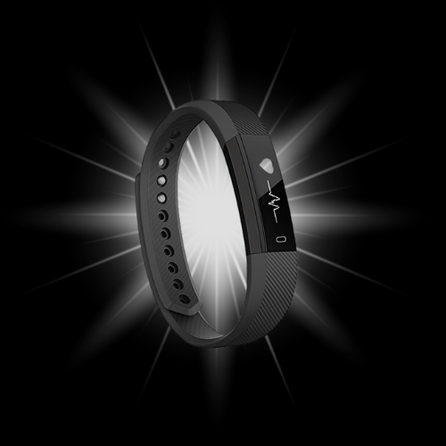
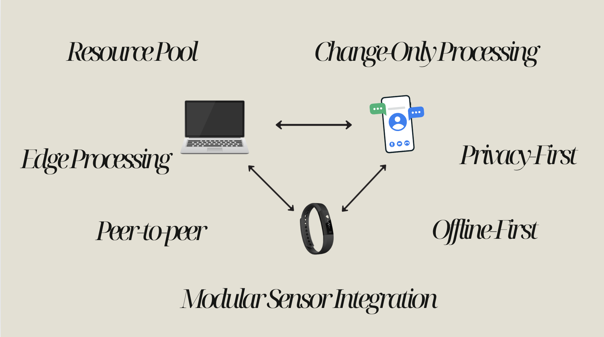

  
  
  

    <em>Companion You Must Have</em>
  

  
  
  

    
    
    
    
  

---

## About Shadow

**Shadow** is an open-source wellness platform designed for privacy-conscious professionals. It unifies data from your Linux laptop, Android phone, and wrist wearable into a cohesive wellness ecosystem with **zero cloud dependency**.

### Key Features
- 🔒 **Privacy-First**: All data processing happens locally on your devices
- 🌐 **Peer-to-Peer**: Devices communicate directly without central servers
- 📊 **Real-time Insights**: Stress management, health monitoring, sleep optimization
- 🔧 **Modular Design**: Easy integration of new devices and sensors

---

## Current Status

### Week 7: TinyML Deployment & Notification System (Current)
- 🔄 **TinyML Model Deployment**: Deploying ExtraTreeClassifier on ESP32-S3 using TensorFlow Lite Micro
- 🔄 **Intelligent Notification Engine**: Implementing smart notification generation system for macOS app
- 🔄 **Real-time Inference Pipeline**: Building on-device ML inference with multi-sensor data fusion
- 🔄 **macOS App Finalization**: Completing notification delivery and user interaction features

### Week 6: macOS Host Application (Completed)
- ✅ **Complete macOS Application**: Swift-based companion application with full UI/UX
- ✅ **BLE Communication Stack**: Implemented robust Bluetooth Low Energy communication protocol
- ✅ **Data Processing Pipeline**: Built comprehensive data preprocessing and analysis framework
- ✅ **Screen Usage Integration**: Integrated screen time monitoring for contextual stress analysis
- ✅ **Core App Architecture**: Established modular app structure with real-time data handling

### Week 5: Model Finalization & TinyML Integration (Completed)
- ✅ **ExtraTreeClassifier Optimization**: Achieved required performance with ExtraTreeClassifier (no H-CNN needed)
- ✅ **Model Architecture**: Finalized and optimized ML model structure with satisfactory accuracy
- ✅ **Multi-Sensor Integration**: Three physiological sensors integrated with ESP32-S3
- ✅ **Real-time Data Acquisition**: 5 physiological parameters collected without latency

### Week 4: AI/ML Model Development (Completed)
- ✅ **Modular AI Structure**: Organized AI model development with proper folder structure
- ✅ **WESAD Dataset Integration**: Complete stress detection model training
- ✅ **ML Model Comparison**: Comprehensive analysis of different ML approaches
- ✅ **Baseline Model**: Initial stress detection implementation

### Week 3: Hardware Integration (Completed)
- ✅ **Device Documentation**: Complete hardware specs for MacBook, Android, and wearable devices
- ✅ **Feasibility Report**: End-to-end integration approach and device compatibility analysis
- ✅ **Hardware Architecture**: Detailed system integration design

### Week 2: Architecture Design (Completed)
- ✅ **Software Architecture**: C4-UML inspired system design
- ✅ **Hardware Architecture**: Device integration blueprint
- ✅ **Component Design**: Modular system architecture

### Week 1: Project Foundation (Completed)
- ✅ **Requirements Specification**: Complete SRS documentation
- ✅ **Project Vision**: Core concept and technical approach defined
- ✅ **Initial Presentations**: Project overview and technical specifications

---

## Technical Architecture

### Core Principles
- **Edge Processing**: All analytics and ML inference on local devices
- **P2P Communication**: Encrypted device-to-device synchronization
- **Resource Pooling**: Dynamic computational load distribution
- **Modular Integration**: Plug-and-play sensor and device support

### System Overview

  

---

## 12-Week Development Roadmap

### ✅ Completed Weeks (1-6)
- **Week 1**: Project foundation and requirements specification
- **Week 2**: Software and hardware architecture design  
- **Week 3**: Device compatibility analysis and documentation
- **Week 4**: AI/ML model development with WESAD dataset
- **Week 5**: Model finalization with ExtraTreeClassifier optimization
- **Week 6**: Complete macOS application with BLE communication and data processing

### 🔄 Current Focus (Week 7)
**TinyML Deployment & Intelligent Notifications**
- Deploying optimized ExtraTreeClassifier model on ESP32-S3 using TensorFlow Lite Micro
- Implementing intelligent notification generation system in macOS app
- Building real-time ML inference pipeline with multi-sensor data fusion
- Creating personalized stress management message generation
- Finalizing end-to-end communication between ESP32 and macOS app

### ⏳ Upcoming Development Phase

**Week 8: Real-time Stress Detection & Feedback**
- Complete end-to-end stress detection pipeline (ESP32 → macOS)
- Implement adaptive notification timing based on stress patterns
- Develop contextual awareness using screen usage and physiological data
- Build user feedback mechanisms for notification effectiveness
- Optimize power consumption on ESP32-S3 for continuous monitoring

**Week 9: Advanced Analytics & Personalization**
- Implement trend analysis and pattern recognition
- Develop personalized stress triggers identification
- Create adaptive thresholds based on user behavior
- Build comprehensive wellness dashboard in macOS app
- Implement data export and privacy controls

**Week 10: System Integration & Android Support**
- Develop Android companion application
- Implement cross-platform data synchronization
- Build unified ecosystem with laptop, phone, and wearable
- Test multi-device stress detection scenarios
- Optimize battery life and performance across all devices

**Week 11: Testing & Optimization**
- Comprehensive system testing and validation
- Performance benchmarking and accuracy improvements
- User experience testing and interface refinement
- Security audit and privacy verification
- Documentation of testing results and performance metrics

**Week 12: Final Integration & Open Source Release**
- Complete ecosystem integration testing
- Finalize documentation and user guides
- Prepare open-source release with contribution guidelines
- Create demo videos and tutorial content
- Community outreach and project presentation

---

## Current Technical Stack

### Hardware Components
- **ESP32-S3**: Main processing unit with TinyML capabilities
- **MAX30102**: Heart rate and SpO2 sensor
- **MPU9250**: 9-axis motion sensor
- **GSR Grove**: Galvanic skin response sensor
- **MLX90614**: Non-contact temperature sensor

### Software Architecture
- **ESP32 Firmware**: C++ with ESP-IDF framework and TensorFlow Lite Micro
- **TinyML**: On-device ExtraTreeClassifier inference
- **macOS Application**: Complete Swift application with BLE and notifications
- **Communication**: Enhanced BLE protocol with real-time data streaming
- **ML Pipeline**: Optimized ExtraTreeClassifier for embedded deployment
- **Notification Engine**: Intelligent stress management messaging system

### Current Capabilities
- Complete macOS companion application with full UI
- Real-time acquisition of 5 physiological parameters
- BLE communication stack with robust error handling
- Screen usage monitoring and contextual analysis
- Optimized ML model ready for TinyML deployment
- Multi-sensor data fusion architecture
- Intelligent notification timing and personalization

---

## Week 7 Focus Areas

### 🎯 Primary Objectives
1. **TinyML Model Deployment**
   - Convert ExtraTreeClassifier to TensorFlow Lite Micro format
   - Implement model inference on ESP32-S3
   - Optimize memory usage and inference speed
   - Test real-time stress classification accuracy

2. **macOS App Notification System**
   - Implement intelligent notification delivery
   - Create personalized stress management messages
   - Build adaptive notification timing algorithms
   - Integrate with macOS notification center

3. **End-to-End Integration**
   - Complete ESP32 to macOS data pipeline
   - Test real-time stress detection workflow
   - Validate BLE communication stability
   - Ensure low-latency inference and notifications

4. **System Optimization**
   - Power consumption optimization on ESP32
   - Memory usage optimization for TinyML model
   - Notification effectiveness and user experience
   - Real-time performance tuning

---

## Documentation

### Deliverables
- **Week 1**: [`deliverables/week1/`](deliverables/week1/) - SRS, presentations
- **Week 2**: [`deliverables/week2/`](deliverables/week2/) - Architecture designs
- **Week 3**: [`deliverables/week3/`](deliverables/week3/) - Hardware documentation
- **Week 4**: [`deliverables/week4/`](deliverables/week4/) - AI/ML models
- **Week 5**: [`deliverables/week5/`](deliverables/week5/) - ExtraTreeClassifier optimization and TinyML integration
- **Week 6**: [`deliverables/week6/`](deliverables/week6/) - Complete macOS application and BLE implementation
- **Week 7**: [`deliverables/week7/`](deliverables/week7/) - TinyML deployment and notification system
- **AI Models**: [`models/`](models/) - Complete AI model development and deployment structure

### Research Papers
Comprehensive research collection in [`deliverables/researchs/`](deliverables/researchs/) covering:
- Advanced signal processing in wearable sensors
- Health monitoring technologies
- Machine learning applications in wellness
- TinyML and edge AI deployment
- Intelligent notification systems

---

## Contributing

We welcome contributions from developers, researchers, and privacy advocates!

### How to Contribute
1. **Star** this repository
2. **Report Issues**: [Open an issue](https://github.com/CSE-ICE-22/Shadow/issues)
3. **Submit PRs**: Fork, create feature branch, commit changes
4. **Join Discussions**: Share ideas and get community support

### Areas of Interest
- TinyML and edge AI deployment
- Intelligent notification systems
- Device integration and sensor support
- Machine learning and AI algorithms
- Privacy engineering and security
- User experience and interface design
- Documentation and tutorials

---

## Community

**Join the Shadow Community**

---

## License

**MIT License** - see [LICENSE](LICENSE) for details

**Privacy Commitment**: Shadow processes no personal data on external servers. All processing occurs on user-controlled devices.

---

  

    <em>Your wellness, your data, your control.</em>
  

