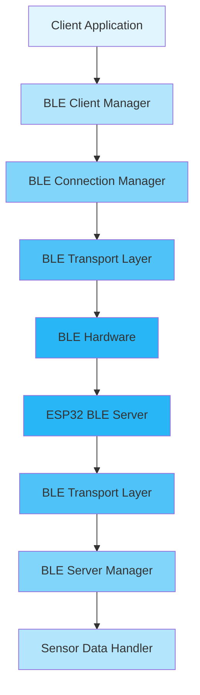
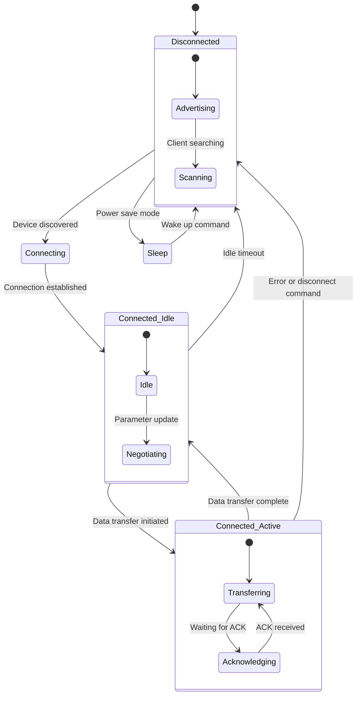

# Shadow BLE Communication Protocol Design

## Overview
This document outlines the design of a robust BLE communication protocol for the Shadow wellness platform, enabling reliable communication between ESP32 wearable devices and macOS client applications with optimized power management.

## Current Implementation Analysis

### macOS Client (BLEClientApp)
- Uses CoreBluetooth framework
- Implements custom service (A000) with three characteristics:
  - Data Characteristic (A001) - for data transmission
  - Control Characteristic (A002) - for control commands
  - Status Characteristic (A003) - for status updates
- Basic connection management with auto-reconnection
- Lacks reliability features like acknowledgments and message queuing

### ESP32 Firmware
- Current firmware uses Bluetooth Serial Profile (SPP) for communication
- No dedicated BLE GATT server implementation
- Simple data streaming without acknowledgment mechanisms
- No power management for BLE connections

## Requirements
1. **Reliability**: Ensure message delivery with acknowledgment mechanisms
2. **Performance**: Optimize communication rate and bandwidth
3. **Power Management**: Connect only when needed to preserve battery life
4. **Error Handling**: Robust error recovery and reconnection logic
5. **Scalability**: Support for multiple sensor data streams

## Proposed Architecture

### Communication Protocol Design



### Service and Characteristic Structure

#### Custom Service (UUID: A000)
- **Data Characteristic (UUID: A001)**
  - Properties: Read, Write, Notify
  - Purpose: Bidirectional data transfer with acknowledgment
- **Control Characteristic (UUID: A002)**
  - Properties: Read, Write
  - Purpose: Device control commands and configuration
- **Status Characteristic (UUID: A003)**
  - Properties: Read, Notify
  - Purpose: Device status updates and health information
- **Command Response Characteristic (UUID: A004)**
  - Properties: Notify
  - Purpose: Asynchronous command responses

### Message Format

#### Data Message Structure
```
+--------+--------+--------+--------+--------+--------+
| Header | Msg ID | Length | Payload | CRC16  | Footer |
+--------+--------+--------+--------+--------+--------+
| 2B     | 4B     | 2B     | Variable| 2B     | 2B     |
+--------+--------+--------+--------+--------+--------+
```

- **Header**: Fixed value (0xAA55) for message identification
- **Message ID**: Unique identifier for each message (used for acknowledgments)
- **Length**: Length of payload in bytes
- **Payload**: Actual data being transmitted
- **CRC16**: 16-bit cyclic redundancy check for error detection
- **Footer**: Fixed value (0x55AA) for message termination

#### Control Message Structure
```
+--------+--------+--------+--------+--------+
| Header | Cmd ID | Length | Payload | CRC16  |
+--------+--------+--------+--------+--------+
| 2B     | 2B     | 2B     | Variable| 2B     |
+--------+--------+--------+--------+--------+
```

### Connection Management

#### Power-Efficient Connection Strategy
1. **Connection Intervals**:
   - Fast connection: 20ms interval for active data transfer
   - Slow connection: 100ms interval for periodic status updates
   - Disconnection after idle timeout (configurable, default 5 seconds)

2. **Connection States**:
   - **Disconnected**: Device is advertising
   - **Connected_Idle**: Connected but no active data transfer
   - **Connected_Active**: Active data transfer in progress
   - **Sleep**: Low power mode with periodic wake-up

#### State Machine



### Reliability Mechanisms

#### Message Acknowledgment
1. Each data message requires an acknowledgment from the receiver
2. Timeout mechanism for unacknowledged messages (default 1000ms)
3. Automatic retransmission of unacknowledged messages (max 3 attempts)
4. Negative acknowledgment (NACK) for corrupted messages

#### Error Handling
1. **CRC Check**: Validate message integrity
2. **Sequence Numbers**: Detect missing or duplicate messages
3. **Timeout Handling**: Automatic recovery from communication failures
4. **Connection Recovery**: Automatic reconnection with exponential backoff

### Performance Optimization

#### Bandwidth Optimization
1. **MTU Negotiation**: Request maximum MTU size (247 bytes for BLE 5.0)
2. **Data Compression**: Optional compression for large payloads
3. **Batching**: Combine multiple small messages into single transmissions
4. **Priority Queuing**: High-priority messages bypass normal queue

#### Communication Rate Optimization
1. **Connection Parameters**:
   - Minimum connection interval: 20ms
   - Maximum connection interval: 100ms
   - Slave latency: 0 (for real-time data)
   - Supervision timeout: 2000ms

2. **Data Rate Control**:
   - Adaptive sampling based on client requests
   - Configurable data transmission intervals
   - Burst mode for high-frequency data

## Implementation Plan

### ESP32 Firmware Implementation

#### Core Components
1. **BLE Server Manager**:
   - GATT service and characteristic implementation
   - Connection parameter negotiation
   - Power management state transitions

2. **Transport Layer**:
   - Message parsing and validation
   - Acknowledgment handling
   - Error detection and recovery

3. **Sensor Data Handler**:
   - Data collection from sensors (MPU6050, MAX30102, GSR)
   - Data formatting according to protocol
   - Queue management for pending transmissions

#### Key Features
- BLE GATT server implementation using NimBLE or ESP-IDF BLE stack
- Message queuing system with priority levels
- Automatic connection parameter optimization
- Power management with sleep/wake cycles
- Error recovery with automatic reconnection

### macOS Client Implementation

#### Core Components
1. **BLE Client Manager**:
   - Device discovery and connection management
   - Service and characteristic discovery
   - Connection state monitoring

2. **Transport Layer**:
   - Message serialization and deserialization
   - Acknowledgment handling
   - Error detection and recovery

3. **Application Interface**:
   - High-level API for data exchange
   - Event callbacks for status updates
   - Configuration management

#### Key Features
- Enhanced CoreBluetooth implementation with reliability features
- Message queuing system with automatic retransmission
- Connection optimization for power efficiency
- Comprehensive error handling and recovery
- Asynchronous API for non-blocking operations

## Protocol Commands

### Control Commands (Client to ESP32)
| Command | ID | Payload | Description |
|---------|----|---------|-------------|
| START_DATA | 0x01 | {interval_ms: uint32} | Start sensor data streaming |
| STOP_DATA | 0x02 | - | Stop sensor data streaming |
| SET_CONFIG | 0x03 | {param_id: uint8, value: variable} | Set device configuration |
| GET_CONFIG | 0x04 | {param_id: uint8} | Get device configuration |
| SLEEP | 0x05 | {duration_sec: uint32} | Enter sleep mode |
| WAKEUP | 0x06 | - | Wake up from sleep mode |
| DISCONNECT | 0x07 | - | Request disconnection |

### Status Messages (ESP32 to Client)
| Status | ID | Payload | Description |
|--------|----|---------|-------------|
| CONNECTED | 0x10 | {device_id: string} | Device connected |
| DISCONNECTED | 0x11 | {reason: uint8} | Device disconnected |
| DATA_STARTED | 0x12 | - | Data streaming started |
| DATA_STOPPED | 0x13 | - | Data streaming stopped |
| ERROR | 0x14 | {error_code: uint8, message: string} | Error occurred |
| CONFIG_UPDATED | 0x15 | {param_id: uint8, value: variable} | Configuration updated |

## Data Formats

### Sensor Data Message
```json
{
  "timestamp": "uint64",
  "sensors": {
    "accelerometer": {
      "x": "float",
      "y": "float", 
      "z": "float"
    },
    "ppg": {
      "ir": "uint32",
      "red": "uint32"
    },
    "gsr": {
      "raw": "uint16",
      "voltage": "float"
    }
  }
}
```

## Power Management Strategy

### Connection Lifecycle
1. **Advertising Phase**:
   - Low power advertising with periodic intervals
   - Fast advertising when client is searching
   - Slow advertising during idle periods

2. **Connected Phase**:
   - Fast connection intervals during data transfer
   - Slow connection intervals during idle periods
   - Automatic disconnection after idle timeout

3. **Sleep Phase**:
   - Deep sleep with periodic wake-up for advertising
   - Wake-up on specific events (button press, timer)
   - Quick reconnection when needed

### Power Optimization Techniques
1. **Dynamic Connection Parameters**:
   - Adjust connection intervals based on data requirements
   - Use slave latency for periodic data
   - Optimize supervision timeout

2. **Data Transmission Optimization**:
   - Batch multiple sensor readings
   - Compress data when possible
   - Use notification instead of indication for high-frequency data

3. **Sleep Management**:
   - Enter sleep mode when idle
   - Wake up periodically to advertise
   - Wake up on external interrupts

## Security Considerations

### Data Protection
1. **Encryption**: Use BLE link-layer encryption
2. **Authentication**: Device pairing and bonding
3. **Data Integrity**: CRC checks for all messages
4. **Access Control**: Whitelist authorized clients

### Privacy
1. **Device Identity**: Use randomized MAC addresses
2. **Data Anonymization**: Remove personally identifiable information
3. **Local Processing**: Process data on device when possible

## Testing and Validation

### Reliability Testing
1. **Message Loss Simulation**: Test acknowledgment and retransmission
2. **Connection Drop Testing**: Verify automatic reconnection
3. **Error Injection**: Test error handling and recovery
4. **Long-term Stability**: Extended operation testing

### Performance Testing
1. **Throughput Measurement**: Data transfer rate testing
2. **Latency Testing**: Response time measurement
3. **Power Consumption**: Battery life impact analysis
4. **Interference Testing**: Operation in noisy environments

## Future Enhancements

### Advanced Features
1. **Multi-device Support**: Connect to multiple sensors simultaneously
2. **OTA Updates**: Wireless firmware updates
3. **Data Logging**: Local data storage with sync capability
4. **Advanced Analytics**: On-device signal processing

### Scalability
1. **Mesh Networking**: Extend to multiple devices
2. **Cloud Integration**: Optional cloud backup and analytics
3. **Cross-platform Support**: Android, iOS, and desktop clients
4. **API Standardization**: RESTful API for device management

## Conclusion

This BLE communication protocol design provides a robust, efficient, and power-optimized solution for the Shadow wellness platform. By implementing acknowledgment mechanisms, connection optimization, and comprehensive error handling, the system ensures reliable communication while preserving battery life. The modular architecture allows for future enhancements and scalability as the platform evolves.